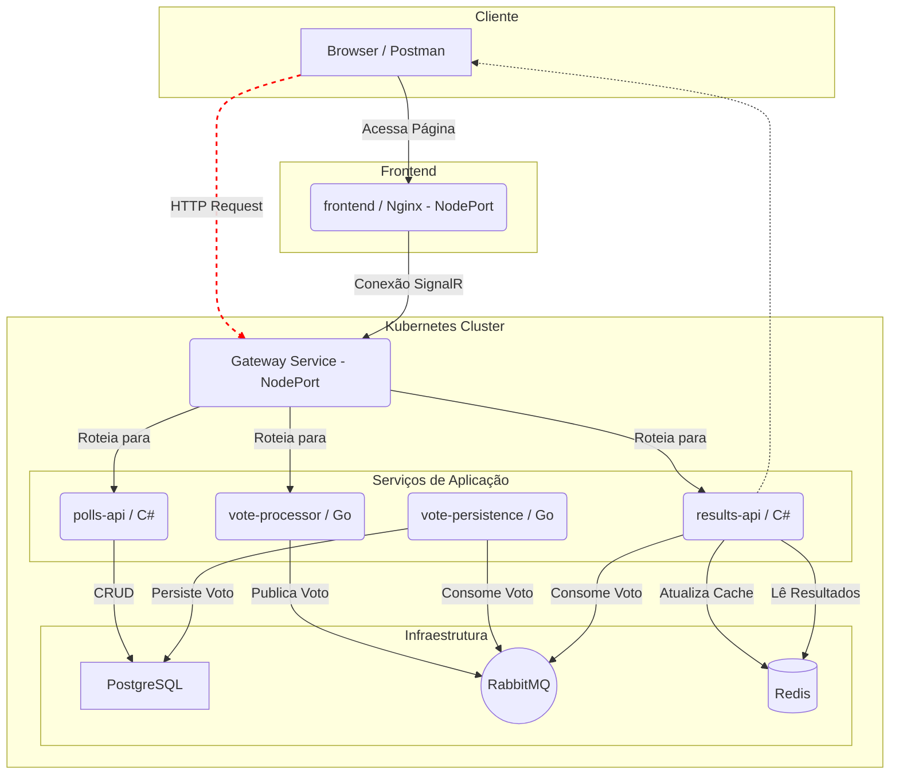

# Plataforma de Votação em Tempo Real

Este projeto é uma demonstração completa de uma arquitetura de microserviços moderna, poliglota, orientada a eventos e observável, construída para ser resiliente e escalável. A aplicação é uma plataforma simples onde usuários podem votar em enquetes e ver os resultados atualizados em tempo real.

## Features

  - **Backend Poliglota:** Microserviços escritos em **C\# (.NET)** e **Go**, utilizando a melhor ferramenta para cada tarefa.
  - **Comunicação Assíncrona:** Utiliza **RabbitMQ** para desacoplar serviços, garantindo resiliência e capacidade de absorver picos de tráfego.
  - **Resultados em Tempo Real:** **Redis** é usado como um cache de alta velocidade para agregar contagens de votos, e o **SignalR** empurra as atualizações para o frontend via WebSockets.
  - **Persistência Robusta:** **PostgreSQL** serve como o banco de dados relacional principal para armazenar dados de forma duradoura.
  - **Observabilidade Completa:** A stack com **Prometheus** e **Grafana** fornece monitoramento e visualização de métricas para toda a aplicação.
  - **Pronto para Orquestração:** Totalmente containerizado com **Docker** e com manifestos prontos para implantação em um cluster **Kubernetes**.
  - **Ponto de Entrada Único:** Um **API Gateway** em Go centraliza e roteia todas as requisições externas.

## System Design & Arquitetura

A arquitetura segue os princípios do **CQRS (Command Query Responsibility Segregation)** e é **Orientada a Eventos**.

  - **Fluxo de Escrita (Commands):** Requisições que alteram o estado (como um novo voto) são processadas rapidamente por serviços leves (`vote-processor`) que publicam um evento em um message broker (RabbitMQ). Workers assíncronos (`vote-persistence`) então consomem esses eventos para persistir os dados no PostgreSQL. Isso torna a escrita extremamente rápida e resiliente.
  - **Fluxo de Leitura (Queries):** Requisições de leitura (como os resultados de uma enquete) são atendidas por serviços que utilizam um armazenamento otimizado para leitura rápida (Redis). Outro worker (`results-api`) também consome os eventos de voto para manter esse cache atualizado.

Essa separação permite escalar e otimizar as operações de leitura e escrita de forma independente.

### Diagrama da Arquitetura



## Tecnologias Utilizadas

  - **Backend:** C\# (.NET 9), Go (Golang)
  - **Frameworks:** ASP.NET Core, MassTransit, SignalR
  - **Bancos de Dados:** PostgreSQL, Redis
  - **Mensageria:** RabbitMQ
  - **Frontend (Simples):** HTML, JavaScript, Nginx
  - **DevOps & Orquestração:** Docker, Docker Compose, Kubernetes
  - **Observabilidade:** Prometheus, Grafana

## Estrutura do Projeto

```
.
├── frontend/             # Contém o cliente web simples (HTML/JS) e seu Dockerfile
├── kubernetes/           # Contém todos os manifestos YAML para o deploy no Kubernetes
│   ├── 00-infrastructure/
│   ├── 01-backend/
│   ├── 02-frontend/
│   └── 03-monitoring/
├── monitoring/           # Contém a configuração do Prometheus
├── src/                  # Código-fonte de todos os microserviços
│   ├── gateway-api/
│   ├── polls-api/
│   ├── results-api/
│   ├── vote-persistence/
│   └── vote-processor/
├── docker-compose.yml    # Arquivo para orquestração em ambiente de desenvolvimento
└── README.md
```

## Pré-requisitos

  - Docker Desktop com Kubernetes ativado
  - .NET SDK (versão 9.0 ou superior)
  - Go (versão 1.24 ou superior)
  - `kubectl` instalado e configurado

## Como Executar

Existem duas maneiras de executar o projeto: um ambiente de desenvolvimento rápido com Docker Compose ou um deploy completo no Kubernetes.

### 1\. Com Docker Compose (Desenvolvimento)

1.  Clone este repositório.
2.  Na raiz do projeto, execute o comando:
    ```bash
    docker-compose up --build
    ```
3.  A aplicação estará disponível nos seguintes endereços:
      - **Frontend:** `http://localhost:8000`
      - **API Gateway (para Postman):** `http://localhost:8080`
      - **RabbitMQ Management:** `http://localhost:15672` (login: guest/guest)
      - **Grafana:** `http://localhost:3000` (login: admin/admin)
      - **Prometheus:** `http://localhost:9090`

### 2\. Com Kubernetes (Deploy)

1.  Certifique-se de que o Kubernetes está ativado no seu Docker Desktop.

2.  **Construa todas as imagens Docker locais:**

    ```bash
    # Backend
    docker build -t polls-api:k8s ./src/polls-api
    docker build -t results-api:k8s ./src/results-api
    docker build -t vote-processor:k8s ./src/vote-processor
    docker build -t vote-persistence:k8s ./src/vote-persistence

    # Frontend
    docker build -t gateway-api:k8s ./src/gateway-api
    docker build -t frontend:k8s ./frontend
    ```

3.  **Aplique os manifestos YAML na ordem correta:**

    ```bash
    # 1. Infraestrutura (DBs, Message Broker)
    kubectl apply -f kubernetes/00-infrastructure/

    # 2. Backend (Nossos microserviços)
    kubectl apply -f kubernetes/01-backend/

    # 3. Frontend (Gateway e a página web)
    kubectl apply -f kubernetes/02-frontend/

    # 4. Monitoramento (Prometheus e Grafana)
    kubectl apply -f kubernetes/03-monitoring/
    ```

4.  Aguarde todos os pods estarem no estado `Running` (`kubectl get pods -w`).

5.  A aplicação estará disponível nos seguintes endereços (`NodePort`):

      - **Frontend:** `http://localhost:30000`
      - **API Gateway (para Postman):** `http://localhost:30080`
      - **Grafana:** `http://localhost:30003`
      - **Prometheus:** `http://localhost:30090`

## Como Testar (Fluxo End-to-End)

1.  **Abra o Frontend** no navegador: `http://localhost:30000` (se usando K8s) ou `http://localhost:8000` (se usando Docker Compose).
2.  **Crie uma Enquete:** Use uma ferramenta como o Postman para enviar uma requisição `POST` para o Gateway:
      - **URL:** `http://localhost:30080/api/polls` (K8s) ou `http://localhost:8080/api/polls` (Compose)
      - **Body (JSON):** `{ "question": "Este projeto é legal?" }`
      - Copie o `"id"` da resposta.
3.  **Conecte o Frontend:** Cole o `id` copiado na caixa de texto da página web e clique em "Conectar". Você verá a mensagem "Conectado\!".
4.  **Vote:** Use o Postman para enviar uma requisição `POST` para o Gateway:
      - **URL:** `http://localhost:30080/api/votes` (K8s) ou `http://localhost:8080/api/votes` (Compose)
      - **Body (JSON):** `{ "pollId": "ID_COPIADO_AQUI", "optionId": "Sim" }`
5.  **Observe a Magia:** A cada voto enviado, a seção de resultados na página web será atualizada em tempo real.

-----